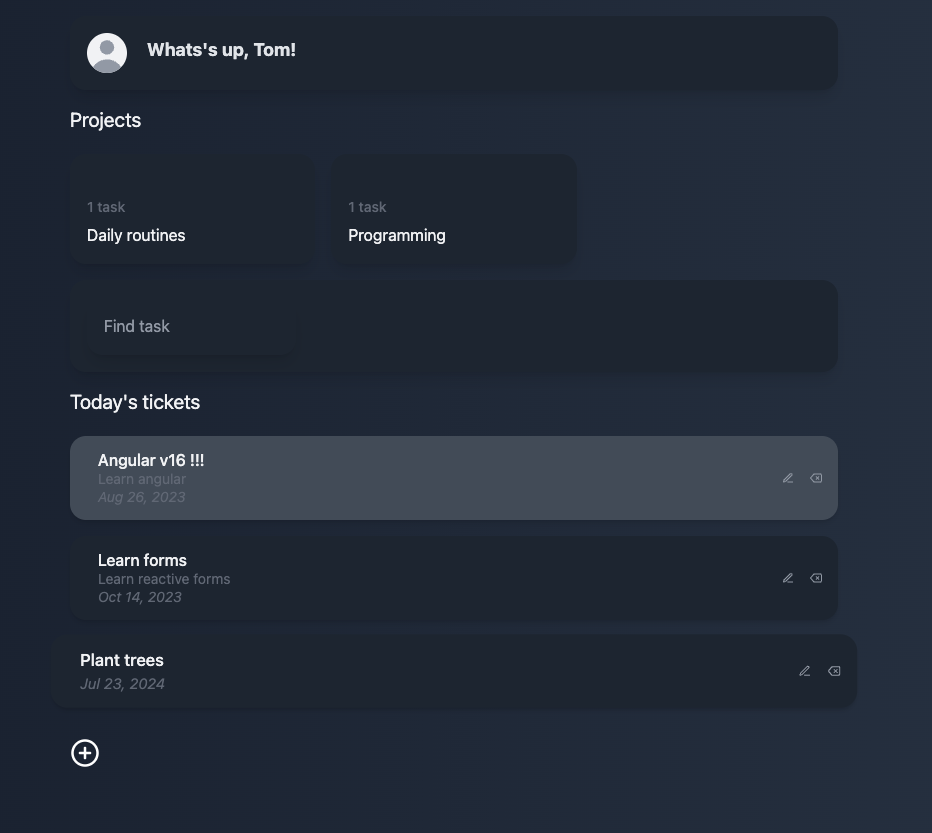
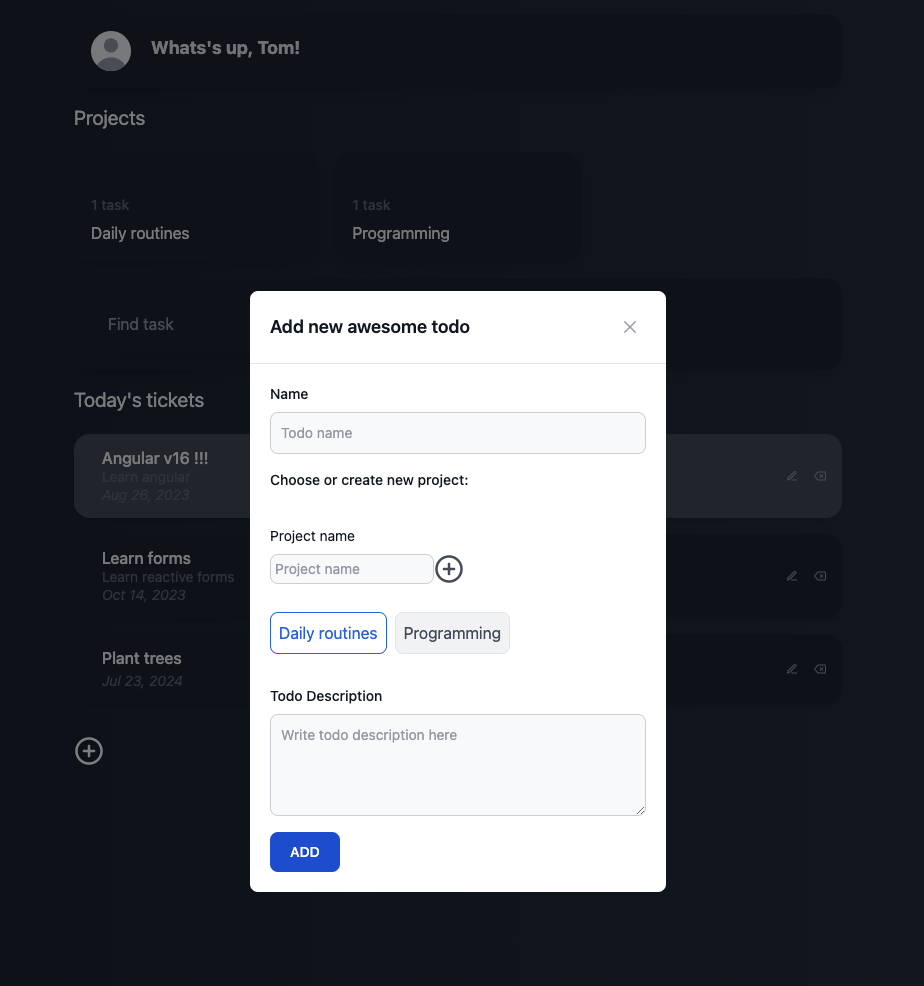

# Todo List

## Description

The "Todo List" project is a simple and functional task manager that allows users to add, edit, and delete tasks. The application is built using Angular for the frontend and JSON-Server for the backend.

## Requirements

- Node.js (recommended version: 18.x or newer)
- Angular CLI (recommended version: 17.x or newer)

## Installation

1. Clone the repository:

2. Navigate to the project directory:

   ```bash
   cd todo-list
   ```

3. Install dependencies:

   ```bash
   npm install
   ```

## Running the application locally

1. Start the frontend using Angular CLI:

   ```bash
   ng serve
   ```

2. In a new terminal, start JSON-Server:

   ```bash
   npm run api
   ```

3. Open your browser and go to [http://localhost:4200](http://localhost:4200) to see the application.

## npm Scripts

- `ng serve` - starts the Angular application in development mode
- `npm run api` - starts JSON-Server, which serves as the application's backend

## Screenshots



